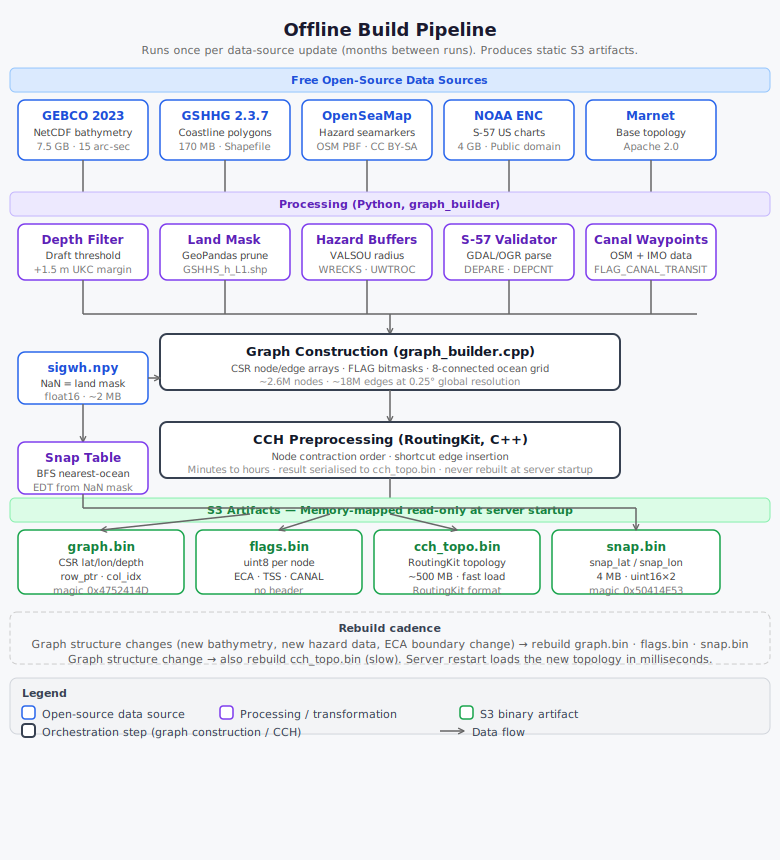
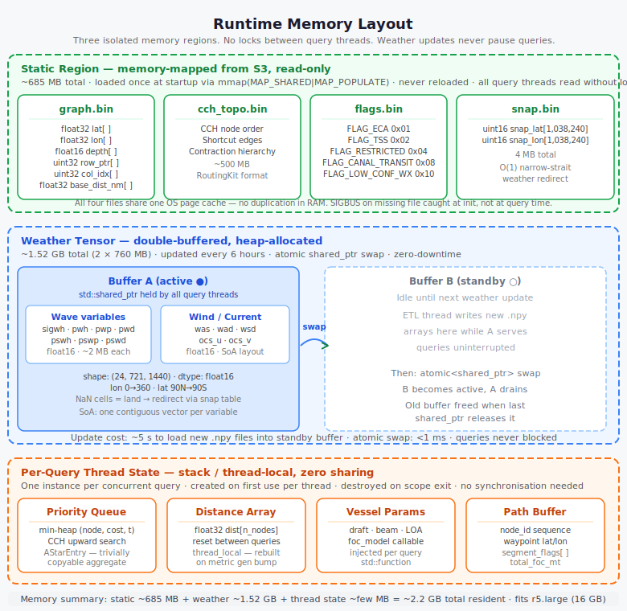
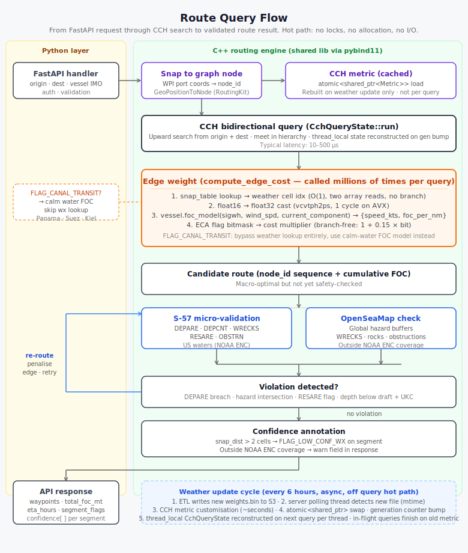

# maritime-router

A C++23 global maritime route optimisation system. Computes fuel-optimal (FOC-minimising) vessel routes using a Customizable Contraction Hierarchy (CCH) graph engine, real-time NOAA GFS weather arrays, and vessel-specific performance models.

---

## Three programs, one shared library

The system is split into three separate executables with distinct cadences and responsibilities. They communicate only through binary files in S3.

```
┌─────────────────────────────────────────────────────────────────────┐
│  graph_builder      (run once per data update — months between runs) │
│                                                                       │
│  GEBCO + GSHHG + OpenSeaMap + NOAA ENC + sigwh.npy                  │
│      → graph.bin  flags.bin  snap.bin  cch_topo.bin                  │
└───────────────────────────────┬─────────────────────────────────────┘
                                │ S3
                                ▼
┌─────────────────────────────────────────────────────────────────────┐
│  weather_etl        (run every 6 hours, triggered by EventBridge)    │
│                                                                       │
│  {var}.npy arrays  +  graph.bin  (for CSR structure)                 │
│      → weights.bin  (CCH edge weight vector)                         │
└───────────────────────────────┬─────────────────────────────────────┘
                                │ S3
                                ▼
┌─────────────────────────────────────────────────────────────────────┐
│  router_server      (long-running, high-concurrency query server)    │
│                                                                       │
│  mmap: graph.bin  flags.bin  snap.bin  cch_topo.bin                  │
│  poll: weights.bin  (every 30s, atomic metric swap on new file)      │
│      → route queries via pybind11 / FastAPI                          │
└─────────────────────────────────────────────────────────────────────┘
```



### Why three programs

The three programs have incompatible runtime characteristics:

| Program | Cadence | CPU profile | Memory |
|---|---|---|---|
| `graph_builder` | Months | CPU-bound for minutes–hours | Ephemeral |
| `weather_etl` | Every 6 hours, ~minutes | I/O + compute burst | Ephemeral |
| `router_server` | Always running | Low CPU, high concurrency | ~2.2 GB resident |

The graph builder has no business being in the query server's process. The weather ETL has no business reading `.npy` files inside the query server. Each program does exactly one job.



---

## Repository layout

```
maritime-router/
├── CMakeLists.txt              Root — composes all targets, fetches dependencies
├── AGENTS.md                   Authoritative ruleset for agents and developers
├── README.md
├── SUMMARY.md                  Agent handoff document — design decisions and status
│
├── lib/
│   ├── CMakeLists.txt          Defines maritime_lib INTERFACE target
│   └── include/maritime/
│       ├── mmap_region.hpp     Rule of Five — the only type with a user destructor
│       ├── static_graph.hpp    Rule of Zero — memory-mapped graph + snap table
│       ├── weather_manager.hpp Rule of Zero — atomic<shared_ptr> double buffer
│       ├── edge_weight.hpp     Free functions — haversine, bearing, per-edge FOC
│       ├── query.hpp           Rule of Zero — time-expanded A* (fallback path)
│       ├── routing_engine.hpp  Rule of Zero — CCH facade, top-level server entry
│       └── weights_header.hpp  Shared WeightsHeader struct (weights.bin contract)
│
├── graph_builder/
│   ├── CMakeLists.txt
│   └── src/
│       ├── main.cpp             CLI entry point
│       ├── graph_builder.hpp/cpp  Pipeline orchestrator
│       ├── gebco_loader.hpp/cpp   GEBCO NetCDF bathymetry
│       ├── gshhg_masker.hpp/cpp   GSHHG land polygon masking
│       ├── canal_injector.hpp/cpp Hardcoded strait and canal waypoint chains
│       ├── snap_table_builder.hpp/cpp  Weather grid NaN → nearest-ocean EDT
│       ├── cch_preprocessor.hpp/cpp   RoutingKit CCH topology build + save
│       ├── graph_serialiser.hpp/cpp   Write graph.bin and flags.bin
│       └── graph_builder.hpp    Public interface (BuildConfig + run())
│
├── weather_etl/
│   ├── CMakeLists.txt           Static library — no main(); called from Python
│   ├── etl.py                   Python ETL entry point (EventBridge-triggered)
│   └── src/
│       ├── npy_loader.hpp/cpp   Read .npy float16 arrays, skip ETL duplicate
│       └── weights_writer.hpp/cpp  Compute + serialise weights.bin
│
├── router_server/
│   ├── CMakeLists.txt
│   └── src/
│       ├── main.cpp             CLI entry point + blocking loop
│       ├── server.hpp/cpp       QueryServer — owns RoutingEngine + polling thread
│       ├── weights_loader.hpp/cpp  Read weights.bin written by weather_etl
│       ├── route_query.cpp      Smoke-test binary — single static-weather query
│       └── voyage_router.cpp    Rolling-horizon multi-day voyage binary
│
└── tests/
    ├── CMakeLists.txt
    ├── unit/
    │   ├── test_haversine.cpp
    │   ├── test_bearing.cpp
    │   ├── test_snap_table.cpp
    │   ├── test_npy_loader.cpp
    │   ├── test_weather_buffer.cpp
    │   ├── test_mmap_region.cpp
    │   ├── test_edge_weight.cpp
    │   └── test_weights_writer.cpp
    └── integration/
        ├── test_graph_round_trip.cpp
        ├── test_snap_round_trip.cpp
        └── test_weights_round_trip.cpp
```

---

## Step-by-step: generating all artifacts

### Prerequisites

```bash
# macOS
brew install netcdf gdal cmake

# Ubuntu / Debian
sudo apt-get install zlib1g-dev libnetcdf-dev libgdal-dev cmake

# Data directories expected by the commands below
data/gebco/GEBCO_2023.nc          # GEBCO 2023 global bathymetry NetCDF
data/gshhg/GSHHS_shp/h/           # GSHHG high-resolution shapefiles
data/weather/2026_06_08_12/       # one subdirectory per 6-hour NOAA forecast cycle
```

### Step 1 — Build all targets

```bash
cmake -B build \
  -DnetCDF_DIR=/opt/homebrew/Cellar/netcdf/4.10.0/lib/cmake/netCDF \
  -DCMAKE_BUILD_TYPE=Release

cmake --build build -j$(nproc || sysctl -n hw.logicalcpu)
```

Produces five binaries:

```
build/graph_builder/maritime-graph-builder
build/weather_etl/maritime-weights-writer
build/router_server/maritime-router-server
build/router_server/maritime-route-query      # single-query smoke test
build/router_server/maritime-voyage-router    # rolling-horizon multi-day
```

### Step 2 — Build graph artifacts (run once per data update)

This step is slow (~15 minutes at 0.25°) because it runs RoutingKit inertial-flow
nested dissection over 700 K+ nodes.

```bash
./build/graph_builder/maritime-graph-builder \
  --gebco  data/gebco/GEBCO_2023.nc   \
  --gshhg  data/gshhg/GSHHS_shp/h    \
  --sigwh  data/weather/2026_06_08_12/sigwh.npy \
  --out    data/artifacts/
```

Produces four files in `data/artifacts/`:

| File | Size | Contents |
|---|---|---|
| `graph.bin` | ~54 MB | CSR graph: lat/lon/depth per node, row_ptr/col_idx/base_dist per edge |
| `flags.bin` | ~715 KB | Per-node bitmask (ECA, TSS, restricted zones, canal transit) |
| `snap.bin` | ~4 MB | Weather-grid snap table (BFS nearest-ocean redirect) |
| `cch_topo.bin` | ~2.8 MB | RoutingKit CCH node order vector |

Add `--no-restrictions` to disable the default Arctic passage restrictions
(useful for debugging; produces an unrealistic but unrestricted routing graph).

### Step 3 — Compute edge weights for a forecast cycle

Run once per 6-hour NOAA cycle. Fast (~seconds).

```bash
./build/weather_etl/maritime-weights-writer \
  --graph  data/artifacts/graph.bin  \
  --flags  data/artifacts/flags.bin  \
  --snap   data/artifacts/snap.bin   \
  --npy    data/weather/2026_06_08_12 \
  --out    data/artifacts/weights.bin \
  --epoch  $(date +%s)
```

The `--step N` flag selects which hour `[0..23]` of the 24-hour forecast to use
as the reference sea state for CCH edge weights (default: 0, i.e. the start of
the cycle).

### Step 4a — Single-query smoke test

Confirms the artifacts are self-consistent and the graph is routable.

```bash
./build/router_server/maritime-route-query \
  --graph    data/artifacts/graph.bin   \
  --flags    data/artifacts/flags.bin   \
  --snap     data/artifacts/snap.bin    \
  --cch      data/artifacts/cch_topo.bin \
  --weights  data/artifacts             \
  --npy      data/weather/2026_06_08_12 \
  --from-lat 51.9  --from-lon 4.5       \
  --to-lat    1.3  --to-lon  103.8
```

Prints waypoint count, total distance (nm), and FOC (MT), then outputs a
`lat,lon` CSV suitable for GeoJSON conversion.

### Step 4b — Rolling-horizon multi-day voyage

Produces a full voyage GeoJSON with per-day segments. Pass one `--npy` per
available forecast cycle, in chronological order. When the vessel's simulated
travel time exceeds the available forecast horizon, the last forecast is reused
until the destination is reached (see [Rolling-horizon weather routing](#rolling-horizon-weather-routing)).

```bash
./build/router_server/maritime-voyage-router \
  --graph    data/artifacts/graph.bin      \
  --flags    data/artifacts/flags.bin      \
  --snap     data/artifacts/snap.bin       \
  --cch      data/artifacts/cch_topo.bin   \
  --npy      data/weather/2026_06_08_12    \
  --npy      data/weather/2026_06_09_12    \
  --npy      data/weather/2026_06_10_12    \
  --from-lat 51.9  --from-lon 4.5          \
  --to-lat    1.3  --to-lon  103.8         \
  --speed    12.0                          \
  --out      voyage_rolling.geojson
```



---

## Hardcoded straits and canals

GEBCO classifies man-made canals (Suez, Panama, Kiel) and many narrow straits as
land or shallow water at 0.25° resolution (~28 km/cell). Without intervention
the graph has no path through these chokepoints, forcing every route around the
relevant continent.

### How it works

`graph_builder/src/canal_injector.cpp` defines nine **waypoint chains** —
sequences of WGS84 `{lat, lon}` coordinates that trace the navigable centreline
of each passage. All coordinates were sourced from the
[searoute-py / Marnet](https://github.com/genthalili/searoute-py) dataset
(Apache 2.0) and cross-checked against nautical charts.

| Passage | Waypoints | Min depth |
|---|---|---|
| Suez Canal | 6 | 24 m |
| Panama Canal | 11 | 13.7 m |
| Bosphorus | 7 | 27.5 m |
| Dardanelles | 4 | 18.0 m |
| Strait of Malacca | 2 | 23.0 m |
| Strait of Hormuz | 3 | 30.0 m |
| Strait of Gibraltar | 4 | 30.0 m |
| Bab-el-Mandeb | 2 | 30.0 m |
| Kiel Canal | 3 | 11.0 m |

During the graph build (`inject_canal_nodes` / `add_canal_edges_to_adj`):

1. Each waypoint is inserted as an artificial graph node tagged `FLAG_CANAL_TRANSIT`.
2. Consecutive waypoints within a chain are connected with bidirectional edges.
3. The **first and last** waypoints of each chain are connected to the *K* nearest
   ocean nodes on their respective sides (default K = 3), creating seamless
   transitions between open water and the canal corridor.

At routing time, `compute_edge_cost()` detects `FLAG_CANAL_TRANSIT` and bypasses
the weather lookup entirely, using a calm-water FOC model instead. This reflects
the sheltered, controlled conditions inside canals and enclosed straits.

### Geographic passage restrictions

In addition to canal injection, the graph builder applies **bounding-box
restrictions** that mark nodes as `FLAG_RESTRICTED` (impassable) to prevent
commercially unrealistic shortcuts:

| Zone | Latitude | Longitude | Rationale |
|---|---|---|---|
| Arctic polar cap | 75°N – 90°N | all | Transpolar routes are not commercially viable |
| Northwest Passage | 65°N – 75°N | 170°W – 60°W | Ice-covered Canadian archipelago |

These defaults mirror the passage restrictions in
[searoute-py](https://github.com/genthalili/searoute-py). They can be disabled
with `--no-restrictions` when building the graph.

---

## Rolling-horizon weather routing

A Rotterdam → Singapore voyage takes ~30 days at 12 knots. A single weather
snapshot is inadequate: conditions on day 14 (Red Sea) bear no relation to
conditions at departure. The rolling-horizon router solves this by
**re-optimising from the vessel's current position every 24 hours** using the
most current available forecast.

### Algorithm

```
current_node  = nearest graph node to origin
dest_node     = nearest graph node to destination
period        = 0

while current_node ≠ dest_node:

    effective = min(period, n_forecasts - 1)   # clamp when horizon is exhausted

    if effective changed since last iteration:
        load npy_dir[effective]  →  WeatherBuffer
        WeightsWriter::compute(graph, wx, ref_step=0)  →  weights vector
        RoutingEngine::update_weights(weights)          # CCH re-customized (~1–2 s)
        RoutingEngine::update_weather(wx)               # FOC buffer swapped atomically

    result = RoutingEngine::route(current_node → dest_node)

    follow result.node_path for 24 h of vessel travel:
        for each edge (from, to):
            elapsed_h += haversine(from, to) / speed_kts
            record waypoint
            if elapsed_h ≥ 24 h or to == dest_node:
                current_node = to
                break

    period++
```

### Forecast exhaustion

When the vessel has not yet reached the destination after all available forecast
cycles, the router continues with the **last available forecast** until arrival.
A log message marks the handover:

```
[voyage] Forecast exhausted after day 7 — extending with last available weather.
```

This means a 30-day voyage with 8 forecast cycles (days 0–7) uses real forecast
data for the first 8 days and extends the Jun 15 sea state for the remaining
~22 days. The path chosen during the extended period is still optimal given
those conditions — the CCH is not re-customized again since the weights have
not changed.

### Why path diversity appears

Each CCH re-customization reflects a genuinely different sea state. A gale in
the Bay of Biscay on day 3 raises edge costs along the Atlantic coast, pushing
the optimizer to hug the Portuguese coast more tightly — a path it would not
have chosen on the calm day-0 forecast. The path through the Suez Canal, Red
Sea, and Indian Ocean similarly shifts corridor-by-corridor as the forecast
evolves.

### Output format

`maritime-voyage-router` writes a GeoJSON `FeatureCollection` with one
`LineString` Feature per day. Each Feature carries:

```json
{
  "properties": {
    "day": 5,
    "dist_nm": 291.4,
    "foc_mt": 19.1
  }
}
```

Load in any GIS tool (QGIS, Kepler.gl, geojson.io) and colour by `day` to
visualise the daily segments and corridor shifts.

---

## Weather in edge cost calculations

Weather influences routing at **two separate points** in the pipeline with different roles and different files. It is important to understand both, because changing one without the other produces inconsistent results.

### 1. CCH weight heuristic — path selection

**File:** `weather_etl/src/weights_writer.cpp`, function `WeightsWriter::compute()`

**When it runs:** offline, once per 6-hour forecast cycle (or once per day in the rolling-horizon router)

**Formula:**
```cpp
const float sig_wh  = static_cast<float>(wx.sigwh[wx_idx]);
const float proxy   = base_nm * (1.f + sig_wh / 6.f);
const uint32_t w    = static_cast<uint32_t>(std::min(proxy * 1e3f, MAX_W));
```

This scales each edge's great-circle distance by a wave-height factor. Calm water (`sig_wh = 0`) leaves the cost equal to distance. A 6 m swell doubles the effective cost. The resulting `uint32_t` vector is passed to the RoutingKit CCH customizer, which bakes it into the acceleration structure used for all path queries.

**Role:** determines which **path** the optimizer chooses. Higher edge costs in rough seas steer the CCH toward calmer corridors.

**What weather variables are used:** `sigwh` only (significant combined wave height).

**How to change it:** edit the proxy formula in `WeightsWriter::compute()`. For example, to also penalize strong headwinds:

```cpp
const float sig_wh   = static_cast<float>(wx.sigwh[wx_idx]);
const float wind_spd = static_cast<float>(wx.was[wx_idx]);
const float proxy    = base_nm * (1.f + sig_wh / 6.f + wind_spd / 20.f);
```

Any variable already present in `WeatherBuffer` (`sigwh`, `was`, `ocs_u`, `ocs_v`, `pwp`, etc.) can be incorporated here without structural changes.

### 2. FOC accumulation heuristic — cost reporting

**File:** `lib/include/maritime/edge_weight.hpp`, function `compute_edge_cost()`

**When it runs:** at query time, once per edge in the route path

**Formula:**
```cpp
// Weather lookup (O(1), snap table already applied)
const float sig_wh      = static_cast<float>(wx.sigwh[wx_idx]);
const float wind_spd    = static_cast<float>(wx.was[wx_idx]);
const float cur_u       = static_cast<float>(wx.ocs_u[wx_idx]);
const float cur_v       = static_cast<float>(wx.ocs_v[wx_idx]);

// Project current onto vessel heading
const float current_comp = cur_u * sin(hdg) + cur_v * cos(hdg);

// Inject vessel model
const auto [speed_kts, foc_per_nm] =
    vessel.foc_model(sig_wh, wind_spd, current_comp);

return foc_per_nm * dist_nm * eca_factor + tss_penalty;
```

**Role:** computes the **reported fuel cost** (MT) of each edge. It uses `sig_wh`, wind speed, and ocean current projected onto the vessel heading. The current component is signed: a following current reduces cost, a head current increases it.

**What weather variables are used:** `sigwh`, `was` (wind speed), `ocs_u`/`ocs_v` (ocean current U/V components).

**How to change it:** the `vessel.foc_model` callable in `VesselParams` (defined in `lib/include/maritime/edge_weight.hpp`) is injected at call sites and is the intended extension point. Replacing the flat lambda with a physics-based model requires no changes to `compute_edge_cost()` itself:

```cpp
vessel.foc_model = [](float sig_wh, float wind_spd, float current_comp)
    -> std::pair<float, float>
{
    // Example: speed decreases with wave height (Beaufort-style)
    const float speed = std::max(4.f, 14.f - sig_wh * 0.8f - wind_spd * 0.1f);
    const float foc   = base_daily_consumption / 24.f / speed;
    return {speed, foc};
};
```

To consume additional weather variables (e.g. wave period `pwp` for resonance effects) the signature of `foc_model` and `compute_edge_cost()` would need to be extended to pass those values through.

### The relationship between the two

The two heuristics are **independent computations** operating on the same weather data. This creates an important constraint: **they must agree on what makes an edge expensive**.

If the FOC model heavily penalises head seas but the CCH weight heuristic only penalises wave height, the CCH will choose a path it considers optimal that the FOC model then reports as expensive. The route looks good to the optimizer but bad to the cost reporter.

The ideal state is for the CCH weight formula to be a **fast, integer approximation** of what `compute_edge_cost()` would return — close enough that the shortest CCH path is also the lowest-FOC path. When you update the FOC model, update the CCH weight formula to match.

| | CCH weight heuristic | FOC accumulation |
|---|---|---|
| **File** | `weather_etl/src/weights_writer.cpp` | `lib/include/maritime/edge_weight.hpp` |
| **Output type** | `uint32_t` (integer, RoutingKit-compatible) | `float` (MT of fuel) |
| **Runs** | Offline, once per forecast cycle | At query time, per edge in path |
| **Controls** | Which path is chosen | What the path costs |
| **Weather variables** | `sigwh` (currently) | `sigwh`, `was`, `ocs_u`, `ocs_v` |
| **Extension point** | Edit proxy formula directly | Replace `VesselParams::foc_model` lambda |

---

## Current FOC model

### What the model does today

The FOC model is a `std::function` stored inside `VesselParams` (defined in
`lib/include/maritime/edge_weight.hpp`). It is injected at the call site before
each route query and is intentionally decoupled from the routing engine — the
engine never knows what vessel it is routing for, only that it can call
`foc_model(sig_wh, wind_spd, current_comp)` to get `{speed_kts, foc_per_nm}`.

The placeholder currently in use in both `route_query.cpp` and
`voyage_router.cpp` ignores all three arguments:

```cpp
vessel.foc_model = [](float /*sig_wh*/, float /*wind_spd*/, float /*current_comp*/)
    -> std::pair<float, float>
{
    return {12.f, 20.f / 24.f / 12.f};
    //      ^^^^  ^^^^^^^^^^^^^^^^^^^^^
    //      12 knots flat (speed never changes)
    //            20 MT/day ÷ 24 h ÷ 12 kts = 0.0694 MT/nm (rate never changes)
};
```

**Effect on routing:** because `speed_kts` is constant, elapsed travel time is
proportional to distance, and `foc_per_nm` is constant, the reported FOC is
simply proportional to the total route distance. Weather variables `sig_wh`,
`wind_spd`, and `current_comp` are received by the function but discarded. The
route path is influenced by weather only through the CCH weight heuristic
(`sigwh` scaling in `weights_writer.cpp`); the reported fuel cost is
weather-blind.

### Where to change it

There is **one place** per binary where the model is injected:

| Binary | File | Line |
|---|---|---|
| `maritime-route-query` | `router_server/src/route_query.cpp` | `vessel.foc_model = ...` |
| `maritime-voyage-router` | `router_server/src/voyage_router.cpp` | `vessel.foc_model = ...` |

In production (via pybind11 / FastAPI) the lambda would be populated from a
Python-side vessel model before each query, so only the binding layer changes.
The C++ engine and `compute_edge_cost()` are unchanged.

No changes are required to `lib/include/maritime/edge_weight.hpp` to improve the
model — the function signature already receives all the necessary environmental
inputs.

### What needs to change for the future implementation

The future improvements described in [Future improvements](#future-improvements)
require two coordinated changes.

#### Change 1 — Speed-loss model inside `foc_model`

Replace the fixed `12.f` speed with a physics-based estimate that accounts for
wave-induced added resistance. A minimal parametric form:

```cpp
vessel.foc_model = [](float sig_wh, float wind_spd, float current_comp)
    -> std::pair<float, float>
{
    // Speed through water: starts at design speed, reduced by sea state.
    // current_comp > 0 = following current (increases effective SOG).
    const float design_speed  = 14.f;                      // kts, calm water
    const float wave_penalty  = sig_wh * 0.8f;             // kts lost per metre of Hs
    const float wind_penalty  = std::max(0.f, wind_spd - 10.f) * 0.05f;
    const float speed_stw     = std::max(4.f, design_speed - wave_penalty - wind_penalty);
    const float speed_sog     = speed_stw + current_comp * 1.944f; // m/s → kts

    // FOC: engine works harder to overcome wave resistance → same power, less speed.
    const float base_daily_mt = 45.f;                      // MT/day at design speed
    // Power ~ speed³; same power at reduced speed means same daily consumption.
    const float foc_per_nm    = base_daily_mt / 24.f / std::max(speed_sog, 1.f);

    return {speed_sog, foc_per_nm};
};
```

The parameters (`design_speed`, `wave_penalty`, `base_daily_mt`) should come
from vessel-specific trial data or a calibrated performance model rather than
being hardcoded.

#### Change 2 — CCH weight heuristic must be updated to match

Because the CCH weight formula in `weather_etl/src/weights_writer.cpp` controls
which **path** is chosen, it must reflect the same speed-loss logic. If the FOC
model now makes head-sea edges significantly more expensive, the CCH must also
penalise them — otherwise the optimizer selects a path that the FOC model rates
as poor.

The weight proxy should approximate what `foc_model` would return for a typical
transit, expressed as an integer cost. For example:

```cpp
// In WeightsWriter::compute(), replace the existing proxy line:
// Before:
const float proxy = base_nm * (1.f + sig_wh / 6.f);

// After (consistent with the speed-loss model above):
const float wave_penalty = sig_wh * 0.8f;
const float speed        = std::max(4.f, 14.f - wave_penalty);
const float foc_per_nm   = 45.f / 24.f / speed;
const float proxy        = foc_per_nm * base_nm;
```

This makes the CCH optimization objective (minimize proxy cost) and the reported
FOC objective (minimize `foc_per_nm × dist_nm`) consistent, so the path the
optimizer chooses is also the path the FOC model considers cheapest.

#### Summary of files to touch

| Step | File | Change |
|---|---|---|
| Speed-loss + FOC model | `router_server/src/route_query.cpp` | Replace `foc_model` lambda |
| Speed-loss + FOC model | `router_server/src/voyage_router.cpp` | Replace `foc_model` lambda |
| CCH weight alignment | `weather_etl/src/weights_writer.cpp` | Update `proxy` formula to match |
| (optional) Extra variables | `lib/include/maritime/edge_weight.hpp` | Extend `compute_edge_cost()` signature if wave period or direction is needed |

The `VesselParams` struct and the `foc_model` signature do not need to change —
the three existing arguments (`sig_wh`, `wind_spd`, `current_comp`) are
sufficient for a first-order speed-loss model.

---

## RAII contract

**Rule of Five** — `MmapRegion` only. `mmap()` returns OS-managed virtual memory that no standard smart pointer can manage. Copy deleted; move nulls the source pointer.

**Rule of Zero** — everything else. `StaticGraph`, `WeatherManager`, `CchIndex`, `RoutingEngine`, `WeatherBuffer`, `QueryServer`, `WeightsWriter` all compose from standard library types whose compiler-generated lifecycle is correct.

**Explicit delete** — `QueryState` deletes copy because copying a partially-explored A\* state produces inconsistent results. Move is compiler-generated.

See `AGENTS.md` for the full enforcement rules.

---

## Weather grid

Confirmed from inspection of the actual `sigwh.npy` file:

```
Shape:      (721, 1440)   lat 90°N → 90°S, lon 0° → 359.75°E
Dtype:      float16       ~2 MB per variable per timestep
Timesteps:  24 hourly steps per 6-hour NOAA cycle
NaN:        land mask — redirected via snap table, never left as NaN
```

Total per `WeatherBuffer`: ~760 MB (14 variables × 24 timesteps × 1,038,240 × 2 bytes).

**ETL double-write bug:** every `.npy` file contains the array written twice (confirmed: file size = `2 × n_elements × 2` bytes). All C++ loaders read only the first `WX_N_POINTS` elements. Fix the ETL before fixing the loaders — they are coordinated.

**Narrow-strait coverage** — at 0.25° resolution (~28 km/cell), several chokepoints fall on land cells:

| Location | Issue | Resolution |
|---|---|---|
| Singapore Strait | ALL\_LAND | Snap table → nearest ocean cell |
| Strait of Malacca S | ALL\_LAND | Snap table → nearest ocean cell |
| Tokyo Bay approach | ALL\_LAND | Snap table → nearest ocean cell |
| Panama, Suez, Kiel, Bosphorus | Enclosed | `FLAG_CANAL_TRANSIT` → calm-water FOC |

---

## Binary file formats

### `graph.bin`

```
[GraphHeader: magic=0x4752414D "MARG", version=1, n_nodes, n_edges]
[float32  lat[n_nodes]]         lon stored in −180..180
[float32  lon[n_nodes]]
[uint16   depth[n_nodes]]       float16 depth in metres, positive down
[uint32   row_ptr[n_nodes+1]]   CSR row pointer array
[uint32   col_idx[n_edges]]     CSR destination node indices
[float32  base_dist_nm[n_edges]] great-circle distances, weather-independent
```

### `flags.bin`

One `uint8_t` per graph node, bitmask:

```
FLAG_ECA            0x01   Emission Control Area
FLAG_TSS            0x02   Traffic Separation Scheme
FLAG_RESTRICTED     0x04   RESARE / ATBA
FLAG_CANAL_TRANSIT  0x08   Enclosed waterway — suppress weather lookup
FLAG_LOW_CONF_WX    0x10   Snap distance >2 cells — warn in API response
```

### `snap.bin`

```
[SnapHeader: magic=0x50414E53 "SNAP", version=1, n_lat=721, n_lon=1440]
[uint16  snap_lat[721 × 1440]]
[uint16  snap_lon[721 × 1440]]
```

Built from `sigwh.npy` NaN mask using BFS nearest-ocean. Identity for ocean cells.

### `cch_topo.bin`

RoutingKit's internal `CustomizableContractionHierarchy` serialisation format. Written by `CchPreprocessor::save()` in `graph_builder`. Loaded by `CchIndex(path)` in `routing_engine.hpp`. Fast load (~milliseconds); avoids rebuilding the topology (~minutes) on each server restart.

### `weights.bin`

```
[WeightsHeader: magic=0x54484757 "WGHT", version=1, n_edges, reserved, base_epoch]
[uint32  weight[n_edges]]   proxy FOC cost scaled by 1e3
```

Written by `WeightsWriter` in `weather_etl`. Read by `WeightsLoader` in `router_server`. The interface contract between the two programs.

---

## Building

### Requirements

- GCC ≥ 13 or Clang ≥ 17, C++23
- CMake ≥ 3.28
- x86-64 with AVX (`-march=native` for float16 → float32 `vcvtph2ps`)
- Linux (`mmap`, `MAP_POPULATE`)
- `zlib` development headers (required by RoutingKit)
- Internet access at first build (FetchContent clones RoutingKit + GoogleTest)

```bash
sudo apt-get install zlib1g-dev
cmake -B build -DCMAKE_BUILD_TYPE=Release
cmake --build build -j$(nproc)
```

---

## Running tests

```bash
cmake -B build -DCMAKE_BUILD_TYPE=Debug
cmake --build build -j$(nproc)
cd build && ctest --output-on-failure
```

Unit tests run in < 1 second, require no artifacts, no network. Integration tests write synthetic binary files to `fs::temp_directory_path()` and clean up after themselves.

---

## Data sources

All sources are freely available; no commercial chart licensing required.

| Artifact | Primary source | Licence |
|---|---|---|
| Bathymetry (`graph.bin` depth) | [GEBCO 2023](https://www.gebco.net/data_and_products/gridded_bathymetry_data/) | Open |
| Land mask | [GSHHG](https://www.soest.hawaii.edu/pwessel/gshhg/) | LGPL |
| Coastlines | [OSM coastlines](https://osmdata.openstreetmap.de/data/coastlines.html) | ODbL |
| Base topology | [searoute-py / Marnet](https://github.com/genthalili/searoute-py) | Apache 2.0 |
| Hazards | [OpenSeaMap](https://www.openseamap.org) | CC BY-SA |
| US coastal charts | [NOAA ENC](https://charts.noaa.gov/ENCs/ENCs.shtml) | Public domain |
| Port locations | [NGA World Port Index](https://msi.nga.mil/Publications/WPI) | Public domain |
| Routing measures EU | [EMODnet Human Activities](https://www.emodnet-humanactivities.eu) | Free |
| ECA zones | MARPOL Annex VI / EPA | Public domain |
| Weather arrays | NOAA GFS wave model, processed `.npy` | Public domain |
| CCH implementation | [RoutingKit](https://github.com/RoutingKit/RoutingKit) | BSD-2-Clause |

---

## Performance

On x86-64 with AVX, `r5.large`-class server (32 vCPU, 16 GB):

| Operation | Latency |
|---|---|
| Server startup (mmap + CCH topology load) | < 5 seconds |
| CCH metric customisation (per weather update) | 2–10 seconds |
| Atomic weights swap | < 1 ms |
| Single CCH route query | 10–500 μs |
| Throughput (32 threads) | 50,000–160,000 queries/s |
| graph_builder full run (0.25° global) | 15–60 minutes |

---

## Limitations

- **Platform:** Linux only (`mmap`, `MAP_POPULATE`).
- **Weather horizon:** 24 hourly timesteps per forecast cycle. Routes longer than 24 hours clamp to the last timestep within a cycle; the rolling-horizon router mitigates this by loading successive cycles. Extend `WX_N_TIMESTEPS` and regenerate for longer intra-cycle forecasts (GFS provides up to 384 hours in raw GRIB2).
- **Bathymetry resolution:** GEBCO at 0.25° (~28 km) for open ocean; NOAA ENC at chart resolution for US waters. Outside US ENC coverage, coastal depth accuracy degrades.
- **float16 compiler support:** requires `_Float16`, available in GCC ≥ 12 and Clang ≥ 15 on x86-64 with `-march=native`.
- **RoutingKit commit pin:** no versioned releases exist. Pin is in `CMakeLists.txt`. Update deliberately, not automatically.
- **NetCDF dependency for GEBCO:** `GebcoLoader` requires linking against `netCDF-C` (`find_package(netCDF)` in `graph_builder/CMakeLists.txt`).
- **GDAL dependency for GSHHG/ENC:** `GshhgMasker` and S-57 micro-validation require GDAL. Add `find_package(GDAL)` to `graph_builder/CMakeLists.txt` when implementing the stubs.

---

## Future improvements

### Speed-loss model (wave-induced resistance)

The current FOC model returns a fixed `{speed_kts, foc_per_nm}` pair regardless
of sea state. In reality, wave-induced added resistance causes a vessel to lose
speed even when maintaining constant engine output. A vessel that is designed for
14 knots in calm water may achieve only 11 knots in 4 m significant wave height —
consuming the same fuel but covering less distance per hour.

The fix requires replacing the flat lambda with a **polar-diagram model**:

```
speed_kts = f(engine_power, sig_wh, wave_period, heading_relative_to_waves)
foc_per_nm = engine_power / (speed_kts * propulsive_efficiency)
```

This can be derived from a vessel's speed-power trial data and parameterised by
wave height and encounter angle. At the graph level, edges with a significant
tailwind or beam sea will have a lower per-nm cost than the same edge in a head
sea — which changes not just the FOC accumulation but the **path** the CCH
chooses, since detours around rough patches become genuinely cost-effective.

### Vessel-specific FOC model

The current placeholder (`20 MT/day flat at 12 kts`) is disconnected from any
physical vessel. A real FOC model requires:

- **SFOC curve** (specific fuel oil consumption, g/kWh vs engine load)
- **Hull resistance model** (calm-water resistance as a function of speed and
  displacement; augmented by added resistance in waves)
- **Propeller efficiency curve** (RPM → thrust → speed through water)

The `VesselParams::foc_model` callable in `edge_weight.hpp` already has the
right signature — `(sig_wh, wind_spd, current_comp) → {speed_kts, foc_per_nm}`.
A future implementation will populate this from a per-vessel lookup table or a
lightweight parametric model trained on noon-report data. Once the model is in
place, the optimizer will produce genuinely vessel-specific routes rather than
geometric approximations.
